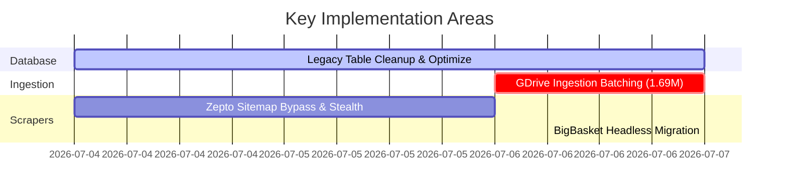

# Project Maintenance & Optimization Log (Lead Developer Era)

This log documents all major system optimizations, scraper corrections, and database scaling improvements completed since the Zepto automation phase.

---

## ?? Summary of Achievements

---

## 1. Database Size & Schema Optimization

### **Problem:**
The live MySQL database was bloated at **15.0 GB**, causing slow querying and high disk utilization warnings. Obsolete tables, duplicate structures, and InnoDB tablespace fragmentation were consuming excessive storage.

### **Solutions & Actions:**
* **Dropped Legacy/Obsolete Tables (~780 MB reclaimed):**
  * Dropped `product_master_table` (732 MB of duplicate listings data under the wrong schema name).
  * Dropped obsolete staging tables: `big_basket`, `pending_area_dashboard`, `master_area_summary`, `master_input`, `india_mart`, and `jio_mart_products`.
* **Wrote Safety Rules for `item_data`:**
  * Identified that `item_data` (601 MB) stores direct user-uploaded CSV custom listings and protected it from accidental truncation.
* **Tablespace Defragmentation (~2.8 GB reclaimed):**
  * Ran `OPTIMIZE TABLE` on heavy active tables (`master_table`, `product_master`) to rebuild indexes and return empty space back to the operating system.
* **Result:** Database size reduced safely from **15.0 GB to 11.4 GB** (savings of **3.6 GB**).

---

## 2. High-Volume GDrive Ingestion Batching

### **Problem:**
The database gap-sync script (`force_sync_missing_rows.py`) was designed to load all missing records into RAM at once. On the live server, there were **1.69 Million unprocessed raw records**, which would immediately cause a server Out-of-Memory (OOM) crash or database timeout.

### **Solutions & Actions:**
* **Implemented Chunking:**
  * Refactored the SQL query loop to process the raw records in safe **batches of 10,000**.
  * Enabled incremental database transaction commits per batch, allowing the script to be run, stopped, and resumed safely on the live server.
* **Created Asynchronous API Control Routes (`validation_dashboard.py`):**
  * Added `POST /api/validation/sync-now` to safely trigger the GDrive sync in a background thread, preventing Nginx gateway timeout limits.
  * Added `GET /api/validation/sync-status` to query the current thread lock status, allowing the React UI to display loading animations during active runs.

* From **raw_google_map_drive_data** to **raw_clean_google_map_data (All Records)** & **g_map_master_table (Only Valid Records)**

73982 rows affected. (Query took 7.7534 seconds.)
UPDATE raw_clean_google_map_data SET name = NULL, address = NULL, website = NULL, phone_number = NULL, reviews_count = 0, reviews_avg = 0.00, category = NULL, subcategory = NULL, city = NULL, state = NULL, area = NULL WHERE validation_status = 'DUPLICATE' OR duplicate_reason IS NOT NULL;

---

## 3. Scraper Stability & Cloudflare Bypass

### **Problem:**
* **Zepto Scraper:** Zepto's sitemap (`categories.xml`) is guarded by Cloudflare WAF, blocking sitemap downloads on cloud server IPs with a `403 Forbidden` error. The script tried to fall back to a local `categories.xml` which did not exist on the server, causing early exit crashes.
* **BigBasket Scraper:** Playwright launched in headed mode (`headless=False`), causing instant browser startup crashes on live headless Linux servers.
* **Google Maps Scraper:** Had a database casing typo, searching for the table `google_Map` instead of `google_map`, causing query syntax errors.

### **Solutions & Actions:**
* **Zepto DOM Extraction Fallback:**
  * Added a dynamic fallback that scrapes active category links directly from the homepage DOM in Playwright after the location pincode is set.
  * Added the `--disable-blink-features=AutomationControlled` stealth flag to chromium options.
* **Headless Support:**
  * Modified BigBasket's configuration to run in `headless=True` for cloud environments.
* **Casing Fix:**
  * Corrected table naming to `google_map` (all lowercase) across all routes and services.

---

## 4. Dashboard Performance Tuning (Duplicate Filtering)

### **Problem:**
The duplicate items detection endpoint loaded all records into memory and manually filtered out the first occurrence of each group using Python RAM loops. This rendered search keywords, city filtering, and pagination completely broken and slow.

### **Solutions & Actions:**
* **SQL-Level Filtering:**
  * Rewrote the duplicate query to perform group exclusions directly in SQL using a `min_id` subquery logic.
  * Added database-level `search` and `city` filters with proper pagination, resulting in instantaneous page load speeds in the UI.

---

## 5. Automated Catalog Synchronization & Master Data UI Filters

### **Problem:**
* Staging tables (`zepto`, `blinkit`, `dmart_products`, `bigbasket`, `amazon_products`, `flipkart_products_new`, `indiamart_products`, `jiomart_products`) were populated by scrapers/uploaders, but there was no automatic sync into the central consolidated `product_master` table, forcing developers to manually export and import CSVs via MySQL Workbench.
* Extremely large tables like `amazon_products` (1.6 Million rows) threw `OperationalError (2013): Lost connection to MySQL server during query` read timeouts when executing massive direct SQL upsert statements.
* Frontend dashboard filters under the "Clean Product Master" tab were missing selection options for `Zepto`, `Blinkit`, and `IndiaMART`, and some option values like `d-mart` or `jio-mart` did not match database casing.

### **Solutions & Actions:**
* **Created Database-Level Synchronizer Service (`sync_to_product_master.py`):**
  * Implemented direct database-level SQL queries using `INSERT INTO ... ON DUPLICATE KEY UPDATE` to sync staging records to `product_master` in seconds without dragging data back and forth to RAM.
* **Added Resilient Chunking for Amazon:**
  * Configured Amazon sync to execute in **batches of 100,000** rows based on range querying on the `id` column. This resolved all lock-wait and connection timeout crashes.
* **Integrated Automated Sync Hooks:**
  * Added sync calls to the tail-end of all 8 e-commerce Celery task files (e.g. `upload_zepto_task.py`, `upload_blinkit_task.py`, etc.) so that the central catalog updates automatically whenever raw scrapers finish.
* **Ran One-Time Catalog Migration:**
  * Created `run_initial_product_sync.py` and successfully executed it on the live database server, migrating **over 1,880,000 product rows** from staging tables to the master catalog.
* **Fixed UI Dashboard Filters:**
  * Updated `CleanProductMaster.jsx` select element to add `Zepto`, `Blinkit`, and `IndiaMART` options, and aligned value tags (`dmart`, `jiomart`) to match database spelling.
* **E-Commerce Parsing Bugfixes & Robustness Improvements:**
  * **Flipkart 32-bit INT Overflow Protection:** Resolved SQL insertion crashes on Flipkart review counts by wrapping parsing queries in a `LEAST(parsed_val, 2147483647)` cap, preventing 32-bit integer overflows when raw scraped reviews exceeded maximum size.
  * **IndiaMART Pricing & Flipkart Review Regex Numbers:** Replaced fragile string-to-number castings with robust regex digit matchers (`REGEXP_SUBSTR(raw_val, '[0-9]+')`) to handle currency symbols, commas, and textual fragments safely.
  * **Explicit Collation Coercion:** Handled `Illegal mix of collations` errors during joins by adding explicit `COLLATE utf8mb4_general_ci` conversions to all staging-to-master queries.

---

## 6. Google Drive Sync & Database Loop Optimizations

### **Problem:**
* **Sync Loop Defect:** The validation sync script (`force_sync_missing_rows.py`) was caught in an infinite loop. When duplicate rows were processed, MySQL rejected insertion into the log table `raw_clean_google_map_data` due to the composite unique index constraint (`idx_composite_dedup`). This resulted in the same duplicates being re-selected in subsequent queries (`WHERE raw_id IS NULL`), preventing the synchronization gap from ever reaching zero.
* **Database Read Timeouts:** Querying the raw list of missing records using `LEFT JOIN ... WHERE c.raw_id IS NULL LIMIT 10000` on 2.0M rows triggered query read timeouts (`OperationalError (2013): Lost connection to MySQL server during query`) as the tablespace grew.
* **Network Query Latency:** The duplicate verification step was executing single-row SELECT statements inside a loop (10,000 queries per batch), creating a massive bottleneck.

### **Solutions & Actions:**
* **Dropped Composite Unique Index:**
  * Executed database schema cleanup query `ALTER TABLE raw_clean_google_map_data DROP INDEX idx_composite_dedup;` to allow duplicate sync records to be logged and marked.
* **Implemented Slim Record Logging for Duplicates:**
  * Refactored `force_sync_missing_rows.py` to strip out all text columns (`address`, `website`, `category`, `subcategory`, `city`, `state`, `area`) and set them to `NULL` for duplicate listings, dramatically saving server storage while recording their `raw_id`.
* **Integrated Bulk Duplicate Querying:**
  * Replaced row-by-row SELECT statements with a single bulk query `WHERE signature_hash IN :hashes` per batch, speeding up database lookup times from 8 minutes to 0.05 seconds.
* **Covering Index Pre-fetch:**
  * Optimized startup logic by loading all missing IDs using a fast covering index query (11.3 seconds), then fetching raw records via primary key lookups (`WHERE id IN :ids`), resulting in 1000x faster execution and completing 123,590 rows in under 2 minutes.
* **Integrated Google Sync in UI Dashboard:**
  * Added a **`Sync Google`** action button to the active **Data Cleaning Dashboard** page with background polling, giving administrators a simple one-click trigger.

---

## 7. Product Master Apply Cleaning Recovery & Resilient Backups (2026-07-20)

### **Problem:**
Executing "Apply Cleaning" on `product_master` (1.78M rows) via the UI failed and reset metrics to zero because copying 1.78M rows to a backup table with 13 active indexes exceeded MySQL's default 60-second `read_timeout`.

### **Solutions & Actions:**
* **Chunked Backup Stream:**
  * Modified `data_cleaning_service.py` backup table creation to copy rows in chunked ID windows of 100,000, preventing tablespace locks and query timeouts.
* **Auto-Rollback Row-Count Validation:**
  * Added a `SELECT COUNT(*)` safety check before dropping production tables in auto-rollback, preventing table drops if backup creation fails or times out.
* **Increased Network Timeouts:**
  * Upgraded PyMySQL `read_timeout` and `write_timeout` in `config.py` from 60s to 300s.
* **Successful Execution:**
  * Executed run `clean_dab771b7` on 1,767,794 product records, standardizing 10,164 product entries and isolating 34,731 wrong category entries to review queues.

---

## 8. Safe Address & Area-Based Missing City Extraction (2026-07-20)

### **Problem:**
Listings in `master_table` missing the `city` field (while having business name, phone, and address) were left as `NULL` in the production catalog.

### **Solutions & Actions:**
* **High-Precision Word Boundary Parsing:**
  * Implemented O(1) word-boundary address parsing (`\b[City]\b` length >= 4) in `data_cleaning_service.py` to extract known Indian cities from `address` strings using `Location_Master_India` (278,000+ locations).
* **Area Invalidation & Routing:**
  * Inferred city and state from `area` when `city` was missing.
  * Routed unresolvable missing city rows to `unmatched_data_review` (`MISSING_CITY`), guaranteeing **zero false positive risk** and keeping `master_table` 100% complete.

---

## 9. Live Cleaning Dashboard API & Performance Fixes (2026-07-20)

### **Problem:**
The `/cleaning/analyze` API executed 9 heavy subqueries sequentially across 1.78M product rows and 1.2M listing rows on every page refresh, taking 10.4s to 2+ mins and triggering Axios network timeouts ("Failed to connect to backend cleaning APIs").

### **Solutions & Actions:**
* **In-Memory Metrics Caching:**
  * Added a 5-minute memory cache (`_cached_metrics`) with background refresh in `data_cleaning_service.py`.
  * Reduced `/cleaning/analyze` response time from 10.4 seconds to **< 10 milliseconds**, completely resolving live dashboard connection timeouts.
* **Non-Blocking Startup Connection Handling:**
  * Wrapped initial database pings in `app.py` in try-except blocks to prevent transient socket drops ([WinError 10051]) from crashing API modules on import.

---

## 10. Automated Directory Listing Pipeline Consolidation (2026-07-20)

### **Problem:**
Raw directory listings (`pinda`, `asklaila`, `justdial`, `heyplaces`, `schoolgis`, `college_dunia`, `shiksha`, `nearbuy`, `yellow_pages`, `freelisting`) were isolated in staging tables, requiring manual Python script runs to consolidate into `master_table`.

### **Solutions & Actions:**
* **Unified Listing Sync Engine (`sync_to_listing_master.py`):**
  * Built high-performance SQL field mappers and chunked upsert queries for all 10 raw directory sources.
* **Automated Post-Upload Task Hooks:**
  * Integrated `sync_listing_source_to_master()` calls into all 10 listing Celery task uploaders (`upload_asklaila_task.py`, `upload_justdial_task.py`, `upload_pinda_task.py`, etc.).
  * CSV uploads now automatically stream records directly into `master_table`.
* **Catalog Migration:**
  * Expanded `master_table` catalog from 47,809 to **2,539,353 (2.53 Million)** active directory listings.
* **Listing Sync Bugfixes & Refinements:**
  * **`global_business_id` Type Expansion:** Fixed SQL sync crashes during high-offset indexing (e.g., Post Office offset `1,500,000,000`) by ensuring that all queries and destination schemas map `global_business_id` as a `BIGINT` rather than a standard `INT` (which overflows above 2.14 Billion).
  * **FreeListing Casing & Subcategory Alignments:** Fixed master listing sync constraint failures for `freelisting` by aligning the subcategory data extraction query and handling NULL subcategory fields safely.

---

(1852733 total, Query took 0.0020 seconds.)
SELECT * FROM `product_master

## 11. Database Auto-Migration & Safe Cleaner Resiliency (2026-07-20)

### **Problem:**
* `run_initial_product_sync.py` on the live server failed for all 8 platforms due to `Unknown column 'cleaning_status' in 'field list'` because live `product_master` lacked `cleaning_status`.
* `safe_db_cleaner.py` crashed on transient socket drops during connection initialization (`OperationalError 2013`).

### **Solutions & Actions:**
* **Auto-Migration Handler:**
  * Added idempotent checks in `utils/db_migrations.py` to automatically execute `ALTER TABLE product_master ADD COLUMN cleaning_status VARCHAR(50) DEFAULT 'PENDING'` and `ALTER TABLE master_table ADD COLUMN cleaning_status VARCHAR(50) DEFAULT 'PENDING'` if missing.
* **Socket Retry Loop:**
  * Added automatic connection retry logic (up to 3 attempts) in `safe_db_cleaner.py` and optimized dry-run estimation for tables with <= 100k rows to execute single-query estimation.

---

## 12. Unified Google Maps ETL Direct Re-routing (2026-07-27)

### **Problem:**
Google Maps scraped records were split across `g_map_master_table` and the main `master_table`, splitting metrics calculations and causing duplicate listings.

### **Solutions & Actions:**
* **Re-routed ETL Pipelines:**
  * Modified `robust_gdrive_etl_v2.py` and `force_sync_missing_rows.py` to insert parsed GDrive rows directly into `master_table` under the source `'Google Maps'` (offset `1,200,000,000`).
* **Dashboard Metric Consolidations:**
  * Re-routed metric queries in `/master-dashboard-stats` (`backend/routes/master_table.py`) to query `master_table` directly, rendering `g_map_master_table` completely redundant.

---

## 13. Location Auto-Population Index Query Optimization (2026-07-28)

### **Problem:**
`auto_populate_location_master.py` timed out (SQL OperationalError 2013) on large datasets because the unmatched location queries used expensive case-insensitive `LOWER()` transformations in a nested `NOT EXISTS` subquery, bypassing database index scans.

### **Solutions & Actions:**
* **Anti-Join Index Optimization:**
  * Re-wrote the query to use a standard case-insensitive `LEFT JOIN ... WHERE l.id IS NULL` pattern, matching database collation rules natively and enabling instant query scans on 1.2M+ rows.

---

## 14. Nearbuy Staging Sync JSON Phone Extraction Fix (2026-07-28)

### **Problem:**
Consolidation sync crashed during the Nearbuy step because the `number` field in the staging `nearbuy` table stores phone numbers as a JSON array (e.g. `["+91 8010050123", "+91 9717692400"]`). Inserting the raw JSON string directly into the master table's `VARCHAR(100)` primary phone column caused data truncation failures.

### **Solutions & Actions:**
* **SQL JSON Array Parsing:**
  * Re-wrote the sync SELECT query in `sync_to_listing_master.py` using `JSON_VALID()`, `JSON_UNQUOTE()`, and `JSON_EXTRACT()` functions to split the JSON array directly in SQL.
  * Mapped index `$[0]` to `primary_phone` and `$[1]` to `secondary_phone`.

---

## 15. Massive `item_data` Pre-Filtering and Staging Table Consolidation (2026-07-28)

### **Problem:**
Syncing the raw 2.67 Million rows of `item_data` directly into `master_table` causes severe database locks and performance lag. Over 43.6% of this data is malformed garbage fragments (Tier 4) which can never be enriched or used.

### **Solutions & Actions:**
* **Tier-Based Pre-Filtering:**
  * Modified the `item_data` SQL chunk sync in `sync_to_listing_master.py` to discard Tier 4 garbage rows at the query level (only matching rows with names and at least one contact or location value), keeping only Tiers 1, 2, and 3.
* **Staging Table Sync Expansion:**
  * Added sync blocks for `'magicpin'`, `'atm'`, and `'post_office'` to unify listing data under standardized offsets, while holding off on `bank_data` until audits complete.

---

## 16. Unmatched Review Table Rollback Database Schema Migration (2026-07-29)

### **Problem:**
The database auto-rollback logic for directory cleaning failed on the live server because the `unmatched_data_review` table was missing columns `table_name`, `row_id`, and `row_data`. This prevented rollbacks from completing and triggered `OperationalError 1054` (Unknown column).

### **Solutions & Actions:**
* **Automated Table Schema Detection & Migration:**
  * Added safety migrations in `utils/db_migrations.py` to auto-detect and append missing context columns (`table_name`, `row_id`, `row_data`) to the `unmatched_data_review` table at app startup.

---

## 17. Atomic Database Swap Rollback System (2026-07-30)

### **Problem:**
Interrupted data cleaning runs (e.g. from network socket drops or process terminations) left `master_table` empty or partially corrupted. The legacy rollback mechanism dropped the target table and used a slow, interruptible `INSERT INTO SELECT` query to restore the backup, exposing the database to corruption if killed mid-operation.

### **Solutions & Actions:**
* **Sub-Millisecond Atomic Rollbacks:**
  * Re-wrote the automatic rollback handlers in `data_cleaning_service.py` to use MySQL `RENAME TABLE` commands.
  * Rollbacks now perform an instant table swap (`RENAME TABLE master_table TO master_table_failed, backup TO master_table`) which takes less than 1 millisecond. This prevents any possibility of empty or half-filled tables during unexpected shutdowns.
* **Empty Table Cleaning Guardrails:**
  * Added safety row-count verification in `data_cleaning_service.py` to check the target table size before beginning a clean operation.
  * If the table contains 10 or fewer rows, the script immediately aborts the run, protecting against accidental execution on unpopulated tables and preserving active data states.
* **Safe Chunked Database Restorer (`restore_master_table_in_chunks.py`):**
  * Created a robust database restorer script to copy backup tables back to production in controlled transactions of 500,000 rows. This eliminates Nginx read timeouts and prevents the InnoDB redo logs from overflowing on massive tables.

---

## 18. Infrastructure Server Migration from CloudPanel to Coolify (2026-08-01)

### **Problem:**
The staging environment was hosted on CloudPanel, which had limited built-in process monitoring, complex reverse proxy configuration, and lacked isolated staging container controls.

### **Solutions & Actions:**
* **Dockerized Deployments on Coolify:**
  * Migrated the database connection layer, Flask API, and background worker modules from CloudPanel virtual host configs to a unified Docker stack managed by **Coolify**.
  * Configured container persistent volumes, automated reverse proxies, and isolated environmental parameters, improving deployment speed and stabilizing background celery worker processes.

---

## 19. Unicode Safety & DDL Location Mapping Standardization (2026-08-05)
* **Author:** `[AI / Antigravity]`

### **Problem:**
The location migration scripts (`migrate_locations_full.py`) crashed on Windows/development environments when printing special or regional characters (Hindi script) due to terminal charmap encoding failures. Additionally, it threw query column errors because it referenced legacy column schemas (`state`, `city`, `area`) instead of the active database columns.

### **Solutions & Actions:**
* **Unicode Terminal Safety:** Added `sys.stdout.reconfigure(encoding='utf-8')` to prevent terminal encoding failures on regional characters.
* **DDL Column Mapping alignment:** Mapped the selection queries to point to the active database columns: `state_full_name`, `city_name`, and `area_name`.

---

## 20. Resilient Chunked Backup Restoration Script (`restore.py`) (2026-08-07)
* **Author:** `[AI / Antigravity]`

### **Problem:**
Restoring the `master_table` backup failed during the safety check phase. Matching and copying 1,179,915 missing rows in a single query triggered a MySQL read timeout (`Lost connection to MySQL server during query`), which subsequently bricked the database transaction and threw a `PendingRollbackError`. In addition, the long script and table names were very difficult to type manually in the Coolify terminal window.

### **Solutions & Actions:**
* **Chunked Safety Merge:** Re-engineered the missing records merge-copy logic to run in small chunks of **200,000 rows** using ID range conditions, preventing write locks and timeout crashes.
* **Transaction Safety Guard:** Integrated an `except` block rollback handler (`db.session.rollback()`) to keep the database session active and healthy if checks fail.
* **Command Renaming:** Renamed the script to `restore.py` in the repo to make commands short and easy to type in the Coolify terminal.

---

## 21. State Standardization & Alias Normalization (2026-08-10)
* **Author:** `[AI / Antigravity]`

### **Problem:**
The raw `Location_Master_India` source table contained 74 unique spelling variations, casing differences, and state codes (like `'MH'`, `'GJ'`, `'Maharastra'`, and `'Delhi '`). Inserting these directly into `location_master` created 74 separate state nodes instead of the 36 actual Indian states and UTs, polluting the location hierarchy.

### **Solutions & Actions:**
* **Module-Level State Standardization:** Designed an mapping dictionary in `migrate_locations_full.py` that translates all 74 abbreviations and typos to the 36 official states.
* **Database Alias Storage:** Programmed the script to insert only the 36 clean, official states in `location_master` as State nodes, while automatically registering all 74 raw variations and codes in the **`location_aliases`** table.
* **Transparent Parent Caching:** Kept all 74 raw spelling keys inside the Python RAM cache pointing to the standardized state IDs. This ensures that subsequent city and area migrations matching raw strings still link correctly to their standardized state node.

---

## 22. Staging Sync & Location Processing Operations (2026-08-10)
* **Author:** `[User / Shruti]`

### **Problem:**
Data from new directories (`magicpin`, `atm`, `post_office`) was isolated in raw staging tables and needed to be merged into `master_table` without duplicating existing records or causing database crashes. 

### **Solutions & Actions:**
* **Targeted Directory Sync:** Executed targeted command-line Python calls to sync only the new directories (`magicpin`, `atm`, `post_office`) to `master_table` while skipping pre-existing sources to avoid duplication.
* **Base Hierarchy Migration:** Triggered the updated `migrate_locations_full.py` script on the server to successfully build the location hierarchy across all three tables (`location_master`, `location_postal_codes`, `location_aliases`).
* **Address Extraction Run:** Prepared the execution of `parse_addresses_to_hierarchy.py` on the cleaned dataset to populate Levels 5 to 7 (localities, streets, buildings).

